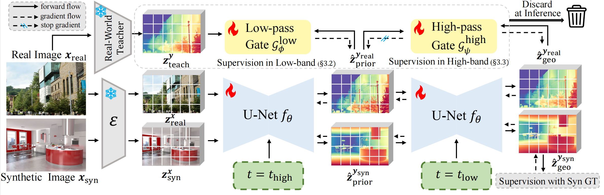

#  Iris: Bringing Real-World Priors into Diffusion Model for Monocular Depth Estimation


we present **Iris**, a Priors-to-Geometry Deterministic framework that injects real-world priors into the diffusion model for monocular depth estimation. Our two-stage schedule separates prior alignment at a high timestep, where Spectral-Gated Distillation transfers low-frequency real priors, from geometry refinement at a low timestep, where Spectral-Gated Consistency enforces high-frequency agreement under an over-activation constraint. Iris preserves fine details, generalizes strongly from synthetic to real scenes, and remains efficient with limited training data, achieving significant improvements across diverse real-image benchmarks and outperforming both prior diffusion-based approaches and large-scale deterministic feed-forward models. 



## 🛠️ Setup
This installation was tested on: Ubuntu 20.04 LTS, Python 3.10, CUDA 12.3, NVIDIA A100-40GB.  


1. Install dependencies (requires conda):
```
conda create -n Iris python=3.10 -y
conda activate Iris
pip install -r requirements.txt 
```

## 📦 Download
- Download the [Iris model](https://huggingface.co/Strike1999/Iris) from Hugging Face and put it in the `trained_models/`


## 🕹️ Inference
### Testing on your images
1. Place your images in a directory, for example, under `assets/in-the-wild_example` (where we have prepared several examples). 
2. Run the inference command: `bash infer.sh`.
3. You can simultaneously view the outputs from both Stage 1 and Stage 2.

## 📊 Evaluation
### Evaluation on benchmark datasets
1. Prepare benchmark datasets:
- Download the [evaluation datasets (depth)](https://share.phys.ethz.ch/~pf/bingkedata/marigold/evaluation_dataset/) by the following commands (referred to [Marigold](https://github.com/prs-eth/Marigold?tab=readme-ov-file#-evaluation-on-test-datasets-)):
    ```
    cd datasets/eval/depth/
    
    wget -r -np -nH --cut-dirs=4 -R "index.html*" -P . https://share.phys.ethz.ch/~pf/bingkedata/marigold/evaluation_dataset/
    ```

2. Run the evaluation command: `bash eval_scripts/eval.sh`


